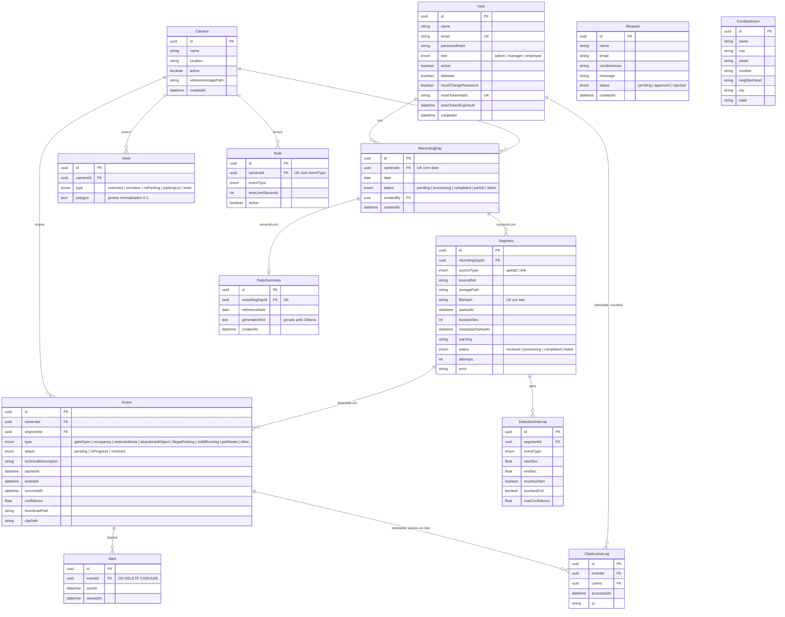

# Documento de Requisitos Ágeis — VisionHub AI

> **Projeto:** VisionHub AI — módulo Condomínios (MVP) · **Disciplina:** APS · **Autor:** Yan Martins de Sousa
> **Versão:** 1.0 · **Data:** 24/09/2026
>
> Este documento consolida os requisitos do produto no formato ágil e é a base para as fases de protótipo,
> implementação e testes. Detalhes técnicos complementares: [requisitos.md](requisitos.md) (RF/RNF),
> [arquitetura.md](arquitetura.md), [database.md](database.md) e [backlog.md](backlog.md).
>
> **Milestone da Sprint no GitHub:** [Sprint — Documento de Requisitos Ágeis](https://github.com/yanmartinss/visionhub-ai/milestone/1)
> (uma issue por user story, com labels MoSCoW e de épico; histórias já implementadas estão fechadas).

## Sumário

1. [Visão do Produto](#1-visão-do-produto)
2. [Personas](#2-personas)
3. [Estrutura de Requisitos](#3-estrutura-de-requisitos)
4. [User Stories](#4-user-stories)
5. [Product Backlog Prioritário (MoSCoW)](#5-product-backlog-prioritário-moscow)
6. [Análise de Riscos e Desafios](#6-análise-de-riscos-e-desafios)
7. [Modelagem do Banco](#7-modelagem-do-banco)

---

## 1. Visão do Produto

**VisionHub AI** é uma plataforma de monitoramento por Visão Computacional + IA que transforma as gravações das
câmeras que o condomínio **já possui** em eventos, alertas e resumos diários — sem trocar câmeras nem acessar o
DVR/NVR em tempo real. O síndico envia os arquivos de gravação do dia (upload ou link); o sistema detecta
automaticamente situações-problema, registra cada ocorrência com horário real e gera um resumo do dia em linguagem
natural.

| Item                  | Descrição                                                                                                                                                                                                                                                  |
| --------------------- | ---------------------------------------------------------------------------------------------------------------------------------------------------------------------------------------------------------------------------------------------------------- |
| **Público-alvo**      | Síndicos e administradoras de condomínios residenciais de pequeno e médio porte; porteiros e zeladores que operam o dia a dia.                                                                                                                             |
| **Problema**          | O CFTV só grava, não interpreta. Para descobrir se o portão ficou aberto, se um carro parou em vaga proibida, se crianças correram no estacionamento ou se um tutor não recolheu o dejeto do pet, alguém precisa assistir horas de vídeo — e quase ninguém assiste. |
| **O que o sistema faz** | Processa as gravações do dia em lote, detecta objetos (YOLO/OpenCV), aplica regras configuráveis por câmera/área (tempo-limite, áreas proibidas), gera eventos com horário real e alertas, e entrega um resumo do dia gerado por IA local (Ollama).         |
| **Benefício esperado** | Menos tempo revisando vídeo, reação mais rápida a irregularidades, histórico confiável de ocorrências para cobrar responsáveis e decidir em assembleia, e retenção mínima de imagens (LGPD).                                                                |

### Objetivo SMART

> **Até 15/12/2026**, entregar o MVP do VisionHub AI para **um condomínio piloto**, processando a gravação de **1 dia
> de pelo menos 1 câmera** (lote dividido em segmentos) e detectando automaticamente os **4 eventos-alvo** (portão
> aberto além do tempo-limite, carro parado em área proibida, criança correndo no estacionamento e dejeto de animal
> fora da lixeira), de forma a **reduzir em pelo menos 80% o tempo diário que o síndico gasta revisando gravações**
> (de ~2 h para ≤ 20 min, lendo o resumo e a lista de eventos) com **precisão mínima de 70%** dos eventos gerados
> (medida pela triagem “resolvido” × “falso positivo” no conjunto de teste).

| Critério           | Como é atendido                                                                                                                            |
| ------------------ | ------------------------------------------------------------------------------------------------------------------------------------------ |
| **S**pecific       | Módulo condomínios, 4 tipos de evento definidos, entrada por arquivo de gravação.                                                          |
| **M**easurable     | Redução ≥ 80% no tempo de revisão; precisão ≥ 70%; 1 dia de 1 câmera processado ponta a ponta.                                             |
| **A**chievable     | Stack open source já em uso (Node, React, PostgreSQL, BullMQ, YOLO, Ollama local); detecção simulada permite validar o fluxo antes do YOLO. |
| **R**elevant       | Dor real de síndicos; aproveita câmeras existentes, sem custo de hardware.                                                                 |
| **T**ime-bound     | Entrega até 15/12/2026 (fim do semestre letivo), dividida em sprints/fatias (ver seção 5).                                                  |

---

## 2. Personas

### Persona 1 — Carla Mendes

| Campo               | Descrição                                                                                                                                                                          |
| ------------------- | ---------------------------------------------------------------------------------------------------------------------------------------------------------------------------------- |
| **Papel**           | Síndica de um condomínio com 120 apartamentos (perfil **gestor** / `manager`).                                                                                                     |
| **Objetivo**        | Saber, sem assistir às gravações, o que aconteceu de irregular no condomínio em cada dia, e ter provas (horário, imagem) para cobrar moradores e levar pautas à assembleia.         |
| **Problema / dor**  | Recebe reclamações (“o portão ficou aberto a noite toda”, “tem carro parado na vaga de visitante”) e não tem tempo nem ferramenta para conferir horas de vídeo do DVR.              |

### Persona 2 — Jorge Almeida

| Campo               | Descrição                                                                                                                                                                  |
| ------------------- | -------------------------------------------------------------------------------------------------------------------------------------------------------------------------- |
| **Papel**           | Porteiro do turno da noite (perfil **funcionário** / `employee`).                                                                                                          |
| **Objetivo**        | Ver rapidamente a lista de ocorrências pendentes, agir sobre elas e marcar como “em andamento” ou “resolvida”.                                                            |
| **Problema / dor**  | Precisa vigiar vários monitores ao mesmo tempo; eventos de longa duração (portão entreaberto, carro parado) passam despercebidos e ele só fica sabendo quando alguém reclama. |

### Persona 3 — Rafael Costa

| Campo               | Descrição                                                                                                                                                                  |
| ------------------- | -------------------------------------------------------------------------------------------------------------------------------------------------------------------------- |
| **Papel**           | Administrador do sistema, técnico da administradora que atende o condomínio (perfil **admin**).                                                                           |
| **Objetivo**        | Cadastrar câmeras, usuários e regras de monitoramento, aprovar solicitações de acesso e garantir que os dados de vídeo sejam tratados conforme a LGPD.                     |
| **Problema / dor**  | Cada condomínio tem câmeras e necessidades diferentes; configurar sistemas de CFTV é trabalhoso e guardar vídeo de moradores por tempo indefinido gera risco legal e custo de armazenamento. |

---

## 3. Estrutura de Requisitos

Organograma em três níveis: **Épico** (objetivo de negócio) → **Funcionalidade** (parte do sistema) → **User Story**.

```mermaid
flowchart LR
    P([VisionHub AI<br/>Módulo Condomínios])

    P --> E8[E8 · Acesso e usuários]
    E8 --> F81[Autenticação] --> U26[US26 Login] & U28[US28 Recuperar/trocar senha]
    E8 --> F82[Solicitação de acesso] --> U27[US27 Solicitar acesso]
    E8 --> F83[Gestão de usuários] --> U29[US29 CRUD de usuários]

    P --> E9[E9 · Prototipação e UX]
    E9 --> F91[Protótipo de telas] --> U31[US31 Wireframes e navegação]

    P --> E6[E6 · Configuração do monitoramento]
    E6 --> F61[Câmeras] --> U30[US30 CRUD de câmeras] & U35[US35 Dados do condomínio]
    E6 --> F62[Regras e áreas] --> U09[US09 Tempo-limite por câmera] & U10[US10 Marcar áreas na imagem]

    P --> E2[E2 · Envio e processamento de gravações]
    E2 --> F21[Envio] --> U15[US15 Upload ou link] & U16[US16 Câmera, data e horário]
    E2 --> F22[Lote do dia] --> U17[US17 Status e progresso] & U36[US36 Avisos de horário/cobertura]
    E2 --> F23[Robustez] --> U18[US18 Reprocessar segmento] & U19[US19 Sem duplicação]

    P --> E1[E1 · Detecção de eventos com IA]
    E1 --> F11[Eventos com duração] --> U01[US01 Portão aberto] & U02[US02 Permanência] & U11[US11 Carro em local proibido] & U04[US04 Objeto abandonado]
    E1 --> F12[Eventos por área] --> U03[US03 Área restrita] & U12[US12 Criança correndo] & U13[US13 Dejeto de animal]
    E1 --> F13[Fusão entre segmentos] --> U14[US14 Evento único entre arquivos]

    P --> E3[E3 · Eventos, dashboard e histórico]
    E3 --> F31[Triagem] --> U32[US32 Status do evento]
    E3 --> F32[Dashboard] --> U05[US05 Eventos do dia] & U20[US20 Timeline com clipe]
    E3 --> F33[Histórico] --> U06[US06 Consulta por data/tipo]

    P --> E4[E4 · Alertas]
    E4 --> F41[Alertas] --> U07[US07 Alerta no processamento] & U37[US37 Notificação por e-mail]

    P --> E5[E5 · IA explicável e resumo]
    E5 --> F51[Resumo do dia] --> U08[US08 Resumo com Ollama]
    E5 --> F52[Explicabilidade] --> U33[US33 Por que o evento foi gerado]
    E5 --> F53[Métricas da IA] --> U34[US34 Precisão por tipo de evento]

    P --> E7[E7 · Armazenamento, retenção e LGPD]
    E7 --> F71[Armazenamento] --> U21[US21 Só clipes comprimidos]
    E7 --> F72[Retenção e acesso] --> U22[US22 Retenção de clipes] & U23[US23 Acesso restrito e log]

    P --> EF[Fase 2 · Tempo real e expansão]
    EF --> FF1[Fora do MVP] --> U24[US24 Câmeras ao vivo] & U25[US25 Alertas em tempo real] & U38[US38 App mobile] & U39[US39 Multi-condomínio] & U40[US40 Controle de acesso]
```

Mesma estrutura em forma de lista (para leitura sem o diagrama):

| Épico                                    | Funcionalidades                                         | User Stories                               |
| ---------------------------------------- | ------------------------------------------------------- | ------------------------------------------ |
| E1 · Detecção de eventos com IA          | Eventos com duração · Eventos por área · Fusão entre segmentos | US01, US02, US03, US04, US11, US12, US13, US14 |
| E2 · Envio e processamento de gravações  | Envio · Lote do dia · Robustez                          | US15, US16, US17, US18, US19, US36         |
| E3 · Eventos, dashboard e histórico      | Triagem · Dashboard · Histórico                         | US05, US06, US20, US32                     |
| E4 · Alertas                             | Alertas                                                 | US07, US37                                 |
| E5 · IA explicável e resumo              | Resumo do dia · Explicabilidade · Métricas da IA        | US08, US33, US34                           |
| E6 · Configuração do monitoramento       | Câmeras · Regras e áreas                                | US09, US10, US30, US35                     |
| E7 · Armazenamento, retenção e LGPD      | Armazenamento · Retenção e acesso                       | US21, US22, US23                           |
| E8 · Acesso e usuários                   | Autenticação · Solicitação de acesso · Gestão de usuários | US26, US27, US28, US29                   |
| E9 · Prototipação e UX                   | Protótipo de telas                                      | US31                                       |
| Fase 2 · Tempo real e expansão           | Fora do MVP                                             | US24, US25, US38, US39, US40               |

---

## 4. User Stories

Formato: **Título** · Como [papel], quero [funcionalidade] para [benefício] · critérios de aceite.
Categorias exigidas pela atividade: 🎨 prototipação · 🔐 login/autenticação · 🤖 IA · 🗂️ CRUD · 💼 negócio.

### E8 · Acesso e usuários

**US26 — Login do usuário** 🔐
Como síndica, quero acessar o sistema com e-mail e senha para ver apenas as informações do meu condomínio de acordo com meu perfil.
- Credenciais inválidas mostram mensagem genérica (sem revelar se o e-mail existe); sessão via JWT em cookie `httpOnly`.
- Usuário inativo não entra; rotas protegidas redirecionam para o login.

**US27 — Solicitação de acesso** 🔐
Como porteiro, quero pedir acesso ao sistema informando nome, e-mail e condomínio para começar a usar sem depender de cadastro manual por telefone.
- O pedido fica “pendente” até um administrador aprovar ou rejeitar; aprovado gera usuário com troca de senha obrigatória no primeiro acesso.

**US28 — Recuperar e trocar senha** 🔐
Como usuário, quero recuperar minha senha por um link temporário e trocá-la quando quiser para não perder o acesso nem depender do administrador.
- Token de uso único, armazenado com hash e com expiração.

**US29 — Gerenciar usuários** 🗂️ 🔐
Como administrador, quero criar, listar, editar o perfil e desativar usuários para controlar quem acessa as imagens do condomínio.
- Perfis: `admin`, `manager` (gestor), `employee` (funcionário); desativar em vez de apagar (histórico preservado).

### E9 · Prototipação e UX

**US31 — Protótipo de telas** 🎨
Como síndica, quero navegar por um protótipo das telas (login, dashboard, gravações, regras/áreas, histórico) antes da implementação para validar se o fluxo atende à rotina do condomínio.
- Wireframes em [`docs/wireframes/`](wireframes/) (dashboard e histórico de eventos) e telas já implementadas em React.
- Assistente de regras em passos (“O que monitorar → Onde → Tempo → Revisão”), com textos em linguagem natural.

### E6 · Configuração do monitoramento

**US30 — Gerenciar câmeras** 🗂️
Como administrador, quero cadastrar, listar, editar e desativar câmeras (nome, localização, imagem de referência) para definir o que será monitorado.

**US35 — Dados do condomínio** 🗂️
Como administrador, quero cadastrar e atualizar os dados do condomínio (nome e endereço) para identificar o cliente nos relatórios e resumos.

**US09 — Configurar regras por câmera** 🗂️ 💼
Como administrador, quero ativar, desativar, editar e excluir regras de monitoramento por câmera (ex.: tempo máximo de portão aberto) para adaptar o sistema à realidade de cada condomínio.
- Uma regra por câmera + tipo de evento; mudar a regra recalcula os eventos dos lotes recentes sem reprocessar o vídeo.

**US10 — Marcar áreas na imagem** 🗂️
Como administrador, quero desenhar áreas (proibido estacionar, estacionamento, lixeira, área restrita) sobre a imagem de referência da câmera para que o sistema saiba onde aplicar cada regra.
- Polígono de 3 a 20 pontos em coordenadas normalizadas; aviso quando uma regra ativa não tem a área necessária.

### E2 · Envio e processamento de gravações

**US15 — Enviar gravação por upload ou link** 💼
Como síndica, quero enviar a gravação do dia por upload ou por link (Drive, OneDrive, servidor do condomínio) para que o sistema a analise sem acesso direto às câmeras.
- Resposta imediata (`202`) e processamento em segundo plano; link só HTTPS e de domínios permitidos.

**US16 — Informar câmera, data e horário** 💼
Como síndica, quero informar câmera, data e horário inicial de cada arquivo para que os eventos tenham o horário real correto.

**US36 — Sugestão de horário e avisos de cobertura** 💼
Como síndica, quero que o sistema sugira o horário de início a partir do nome do arquivo e me avise sobre lacunas, sobreposições ou horário divergente dos metadados para não gerar eventos com horário errado.

**US17 — Acompanhar o lote do dia** 💼
Como síndica, quero ver o status do lote do dia e o progresso de cada segmento (recebido, processando, concluído, falhou) para saber quando a análise termina.

**US18 — Reprocessar segmento** 💼
Como síndica, quero reprocessar apenas o segmento que falhou para não perder o dia inteiro por causa de um arquivo.

**US19 — Reenvio sem duplicação** 💼
Como síndica, quero que o reenvio do mesmo arquivo não gere eventos duplicados para manter o histórico confiável (idempotência por hash SHA-256).

### E1 · Detecção de eventos com IA

**US01 — Portão aberto por tempo excessivo** 🤖 💼
Como síndica, quero que o sistema detecte portões abertos por mais tempo que o limite configurado para não depender de revisar gravações manualmente.

**US02 — Permanência prolongada** 🤖
Como porteiro, quero ser avisado quando alguém permanecer muito tempo parado em uma área sensível (portaria, entrada) para identificar situações suspeitas.

**US03 — Acesso a área restrita** 🤖
Como síndica, quero ser notificada quando alguém entrar em uma área marcada como restrita para agir em caso de invasão.

**US04 — Objeto abandonado** 🤖
Como porteiro, quero que objetos deixados por muito tempo sejam detectados para verificar possíveis riscos.

**US11 — Carro em local proibido** 🤖 💼
Como síndica, quero que carros parados em áreas de “proibido estacionar” além do tempo-limite sejam detectados para agir sobre a irregularidade.

**US12 — Criança correndo no estacionamento** 🤖
Como síndica, quero que crianças em movimento no estacionamento sejam sinalizadas para prevenir acidentes.

**US13 — Dejeto de animal fora da lixeira** 🤖 💼
Como síndica, quero que dejetos de animais não descartados nas lixeiras sejam detectados para cobrar os responsáveis.

**US14 — Evento único entre arquivos** 🤖
Como síndica, quero que um evento que começa no fim de uma gravação e termina no começo da seguinte seja tratado como um só para não receber ocorrências quebradas ou duplicadas.

### E3 · Eventos, dashboard e histórico

**US32 — Triagem de ocorrências** 🗂️ 💼
Como porteiro, quero mudar o status de um evento (pendente → em andamento → resolvido) para que a equipe saiba o que já foi tratado.
- Liberado para qualquer perfil; reprocessar o vídeo ou mudar a regra não apaga o status definido pelo usuário.

**US05 — Dashboard do dia** 💼
Como usuário, quero ver um dashboard com os eventos do dia, contadores por tipo e pendências para acompanhar o que aconteceu assim que o lote é processado.

**US06 — Histórico de eventos** 💼
Como síndica, quero consultar o histórico de eventos filtrando por data, câmera, tipo e status para investigar ocorrências passadas.

**US20 — Timeline com thumbnail e clipe** 💼
Como síndica, quero uma timeline dos eventos do dia com thumbnail e clipe curto de cada um para ver o que aconteceu sem assistir às horas de gravação.

### E4 · Alertas

**US07 — Alerta de evento relevante** 💼
Como porteiro, quero receber um alerta no sistema assim que um evento relevante for identificado no processamento de um lote para agir sobre a ocorrência.

**US37 — Notificação por e-mail** 💼
Como síndica, quero receber por e-mail o resumo do dia e os alertas mais graves para ficar informada sem abrir o sistema.

### E5 · IA explicável e resumo

**US08 — Resumo do dia com IA** 🤖
Como síndica, quero receber um resumo do dia em linguagem natural, gerado por um modelo de linguagem local (Ollama) a partir dos eventos, para entender rapidamente o que aconteceu sem ler registros técnicos.
- Gerado quando todos os segmentos do lote terminam; o texto cita apenas eventos registrados (sem inventar ocorrências); nenhum dado sai do servidor.

**US33 — Explicabilidade da detecção** 🤖
Como síndica, quero ver por que cada evento foi gerado (tipo de objeto detectado, área e regra aplicadas, duração, confiança do modelo e thumbnail) para confiar no alerta antes de cobrar um morador.

**US34 — Métricas de desempenho da IA** 🤖
Como administrador, quero ver a precisão por tipo de evento (eventos confirmados × marcados como falso positivo na triagem) para ajustar regras, áreas e limites de confiança.

### E7 · Armazenamento, retenção e LGPD

**US21 — Guardar só clipes comprimidos** 💼
Como síndica, quero que o sistema guarde apenas clipes comprimidos dos eventos e descarte o vídeo original para não estourar o armazenamento.

**US22 — Retenção de clipes** 🤖 (uso de dados)
Como administrador, quero que os clipes sejam apagados após um período configurável, mantendo eventos e thumbnails, para cumprir a LGPD.

**US23 — Acesso restrito e registro** 🤖 (uso de dados)
Como síndica, quero que o acesso aos clipes seja restrito por perfil e registrado (quem viu, quando) para saber quem visualizou imagens de moradores.

### Fase 2 · Tempo real e expansão (fora do MVP)

- **US24 — Câmeras ao vivo:** Como porteiro, quero ver eventos em tempo real vindos das câmeras (RTSP/ONVIF/IP) para agir no momento em que ocorrem.
- **US25 — Alertas em tempo real:** Como porteiro, quero receber alertas instantâneos (Socket.IO) para reagir imediatamente.
- **US38 — Aplicativo mobile:** Como síndica, quero um app nativo para receber alertas no celular.
- **US39 — Vários condomínios:** Como administrador, quero gerenciar vários condomínios isolados na mesma instalação para atender toda a carteira da administradora.
- **US40 — Integração com controle de acesso:** Como síndica, quero integrar catracas e fechaduras para acionar o portão a partir do sistema.

---

## 5. Product Backlog Prioritário (MoSCoW)

**Must** → essenciais · **Should** → importantes, não críticas · **Could** → desejáveis · **Won't** → fora do escopo inicial.
A coluna “Entrega” indica a fatia/sprint em que a história foi ou será implementada.

| Ordem | ID   | User Story                               | Épico | MoSCoW     | Entrega                 |
| ----- | ---- | ---------------------------------------- | ----- | ---------- | ----------------------- |
| 1     | US26 | Login do usuário                         | E8    | **Must**   | ✅ Sprint 1             |
| 2     | US29 | Gerenciar usuários                       | E8    | **Must**   | ✅ Sprint 1             |
| 3     | US27 | Solicitação de acesso                    | E8    | **Must**   | ✅ Sprint 1             |
| 4     | US31 | Protótipo de telas                       | E9    | **Must**   | ✅ Sprint 1 (wireframes) |
| 5     | US30 | Gerenciar câmeras                        | E6    | **Must**   | ✅ Sprint 1             |
| 6     | US15 | Enviar gravação por upload ou link       | E2    | **Must**   | ✅ Fatia A              |
| 7     | US16 | Informar câmera, data e horário          | E2    | **Must**   | ✅ Fatia A              |
| 8     | US17 | Acompanhar o lote do dia                 | E2    | **Must**   | ✅ Fatia A              |
| 9     | US09 | Configurar regras por câmera             | E6    | **Must**   | ✅ Fatia B              |
| 10    | US10 | Marcar áreas na imagem                   | E6    | **Must**   | ✅ Fatia B              |
| 11    | US01 | Portão aberto por tempo excessivo        | E1    | **Must**   | ✅ Fatia C (simulada)   |
| 12    | US11 | Carro em local proibido                  | E1    | **Must**   | ✅ Fatia C (simulada)   |
| 13    | US12 | Criança correndo no estacionamento       | E1    | **Must**   | ✅ Fatia C (simulada)   |
| 14    | US13 | Dejeto de animal fora da lixeira         | E1    | **Must**   | ✅ Fatia C (simulada)   |
| 15    | US14 | Evento único entre arquivos              | E1    | **Must**   | ✅ Fatia C              |
| 16    | US07 | Alerta de evento relevante               | E4    | **Must**   | ✅ Fatia C (registro)   |
| 17    | US32 | Triagem de ocorrências                   | E3    | **Must**   | ✅ Fatia C              |
| 18    | US05 | Dashboard do dia                         | E3    | **Must**   | Fatia D                 |
| 19    | US06 | Histórico de eventos                     | E3    | **Should** | Fatia D                 |
| 20    | US18 | Reprocessar segmento                     | E2    | **Should** | ✅ Fatia A              |
| 21    | US19 | Reenvio sem duplicação                   | E2    | **Should** | ✅ Etapa 2              |
| 22    | US36 | Sugestão de horário e avisos de cobertura | E2   | **Should** | ✅ Fatia C              |
| 23    | US28 | Recuperar e trocar senha                 | E8    | **Should** | ✅ Sprint 1             |
| 24    | US35 | Dados do condomínio                      | E6    | **Should** | ✅ Sprint 1             |
| 25    | US03 | Acesso a área restrita                   | E1    | **Should** | ✅ Fatia C (simulada)   |
| 26    | US02 | Permanência prolongada                   | E1    | **Should** | ✅ Fatia C (simulada)   |
| 27    | US04 | Objeto abandonado                        | E1    | **Should** | ✅ Fatia C (simulada)   |
| 28    | US20 | Timeline com thumbnail e clipe           | E3    | **Should** | Fatia E                 |
| 29    | US21 | Guardar só clipes comprimidos            | E7    | **Should** | Fatia E                 |
| 30    | US22 | Retenção de clipes                       | E7    | **Should** | Fatia E                 |
| 31    | US08 | Resumo do dia com IA                     | E5    | **Should** | Fatia F                 |
| 32    | US33 | Explicabilidade da detecção              | E5    | **Should** | Fatias D/G              |
| 33    | US23 | Acesso restrito e registro               | E7    | **Could**  | Fatia E                 |
| 34    | US34 | Métricas de desempenho da IA             | E5    | **Could**  | Fatia G                 |
| 35    | US37 | Notificação por e-mail                   | E4    | **Could**  | pós-MVP                 |
| 36    | US24 | Câmeras ao vivo (RTSP/ONVIF)             | Fase 2 | **Won't** | Fase 2                  |
| 37    | US25 | Alertas em tempo real                    | Fase 2 | **Won't** | Fase 2                  |
| 38    | US38 | Aplicativo mobile                        | Fase 2 | **Won't** | —                       |
| 39    | US39 | Vários condomínios                       | Fase 2 | **Won't** | —                       |
| 40    | US40 | Integração com controle de acesso        | Fase 2 | **Won't** | —                       |

> “Simulada”: a detecção roda hoje com um detector simulado (JSON) atrás do mesmo contrato que o serviço Python
> com YOLO implementará na Fatia G — trocar um pelo outro é só uma variável de ambiente.

**Resumo MoSCoW**

- **Must:** login, gestão de usuários, solicitação de acesso, protótipo de telas, câmeras, envio de gravação,
  lote do dia, regras e áreas, detecção dos 4 eventos-alvo, fusão entre segmentos, alertas, triagem e dashboard.
- **Should:** histórico, reprocessamento, idempotência, avisos de horário, recuperação de senha, dados do condomínio,
  área restrita, permanência, objeto abandonado, timeline com clipe, armazenamento só de clipes, retenção,
  **resumo com IA** e **explicabilidade da IA**.
- **Could:** log de acesso a clipes, **métricas de desempenho da IA**, notificação por e-mail.
- **Won't (nesta versão):** tempo real (RTSP/ONVIF, Socket.IO), app mobile, multi-condomínio, integração com catracas.

---

## 6. Análise de Riscos e Desafios

| # | Risco                                                                                                                                              | Tipo            | Impacto   | Mitigação                                                                                                                                                                                                                         |
| - | -------------------------------------------------------------------------------------------------------------------------------------------------- | --------------- | --------- | --------------------------------------------------------------------------------------------------------------------------------------------------------------------------------------------------------------------------------- |
| 1 | **Baixa precisão da IA** (YOLO) em câmeras noturnas, de baixa resolução ou ângulo ruim, gerando falsos positivos (ex.: adulto tomado por criança) ou eventos perdidos. | Técnico / IA    | **Alto**  | Limite de confiança e tempo-limite configuráveis por regra; triagem com status para medir precisão (US34); validar primeiro com detector simulado e depois com trecho real curto (10–30 min); exibir confiança e thumbnail (US33) para revisão humana antes de qualquer cobrança. |
| 2 | **Vazamento ou uso indevido de imagens de moradores** (dados pessoais sob a LGPD), inclusive de crianças.                                          | Legal / Ético   | **Alto**  | Guardar só clipes curtos e thumbnails; apagar o original após processar e os clipes após X dias (US21–US22); acesso por perfil e log de visualização (US23); IA 100% local (Ollama), sem enviar imagens a serviços externos; links de download só de domínios permitidos. |
| 3 | **Volume de vídeo** (10–40 GB por câmera por dia) estourar disco, memória ou tempo de processamento.                                               | Técnico         | **Médio** | Processamento em streaming, 1 job por segmento em fila (BullMQ) com retentativa; amostragem de ~1 frame a cada 1–2 s; limite de tamanho por arquivo; descarte do original após processar.                                         |
| 4 | **Horário real errado** dos eventos (relógio do DVR desajustado, nome de arquivo sem horário), comprometendo a prova de uma ocorrência.            | Dados           | **Médio** | Horário informado pelo síndico no envio, com sugestão pelo nome do arquivo; comparação com o metadado do vídeo (ffprobe) e aviso de divergência; avisos de lacuna/sobreposição entre segmentos (US36).                              |
| 5 | **Hardware insuficiente** para rodar YOLO e Ollama localmente dentro do prazo, e **acesso às gravações** depender da boa vontade do síndico/empresa de segurança. | Negócio / Prazo | **Médio** | Arquitetura por arquivo (não exige acesso à câmera); modelos leves (YOLOv8n, LLM pequeno quantizado); detecção simulada permite entregar o fluxo completo antes da Fatia G; demo com trecho curto de gravação real.                  |

---

## 7. Modelagem do Banco

Banco relacional **PostgreSQL**, acessado via Prisma ORM. O diagrama abaixo cobre **todo o sistema**: as 12 tabelas
já implementadas (`backend/prisma/schema.prisma`) e as entidades planejadas para as próximas fatias
(marcadas como _planejada_). Todas as chaves primárias são UUID. Dicionário de dados completo em [database.md](database.md).

**Observações da modelagem**

- **Lote do dia:** `RecordingDay` é único por (`cameraId`, `date`); cada `Segment` é um arquivo de gravação e um job
  independente na fila. `Segment.fileHash` é único por lote (idempotência, US19).
- **Regras × áreas:** não há FK entre `Rule` e `Area` — elas se ligam pelo tipo (ex.: regra `illegalParking` usa
  áreas `noParking`), porque uma câmera pode ter várias áreas do mesmo tipo.
- **Eventos:** `Event` é único por (`cameraId`, `type`, `occurredAt`), chave do upsert da finalização do lote; o
  `status` definido pelo usuário é preservado em reprocessamentos.
- **Independentes:** `Request` (pedido de acesso, antes de existir usuário) e `Condominium` (instalação de um único
  condomínio no MVP) não têm FK; na Fase 2 (US39, multi-condomínio) `Condominium` passa a ser referenciado por
  `User` e `Camera`.
- **Planejada:** `ClipAccessLog` (Fatia E, US23) registra quem visualizou cada clipe, para a LGPD.
